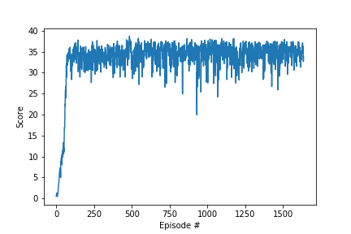

# Report
## RL algorithm

For this problem I use Deep Deterministic Policy Gradient (DDPG) algorithm[1]. I use 20-agent environment. These agent share the same replay buffer and has no other kinds of information sharing during the training process. 

The actor network has 2 hidden layers, both fully connected and with 400 and 300 neurons respectively. The network use ReLu as non-linear activation function. THe output layers use Tanh as the activation function and return a vector of length 4. 

The critic Network has 2 hidden layers with the same model atchitecture. The only difference is that Critic network return a scaler which is the estimated Q-value.

USe Adam optimized to optimize both Actor and Critic Network.

Hyperparameters: 
BUFFER_SIZE = int(1e5)  # replay buffer size 
BATCH_SIZE = 128        # minibatch size 
GAMMA = 0.99            # discount factor 
TAU = 1e-3              # for soft update of target parameters 
LR_ACTOR = 1e-4         # learning rate of the actor  
LR_CRITIC = 1e-3        # learning rate of the critic 
WEIGHT_DECAY = 0        # L2 weight decay 

## Results

This problem is considerd solved after the agents achieve an average score of +30 over 100 episodes. We achieve this average score and continue training to generate the score plot:

As you can see the optimal performance is roughly +34 oever 100 episodes. The performance doesn't deteriorate. 

## Future Work
It would be worthwhile to try differenct architectures. Also, training 20 agents who share the same replay buffer is not the real multi-agent environment. It is also great if we can train our agents in a multi-agent environment where information sharing is possible. 
Simpler pocicy-based methods should also be able to achieve the goal. 

## References
[1] <a href="https://arxiv.org/pdf/1509.02971.pdf" target="_blank">Continuous control with deep reinforcement learning</a> 

